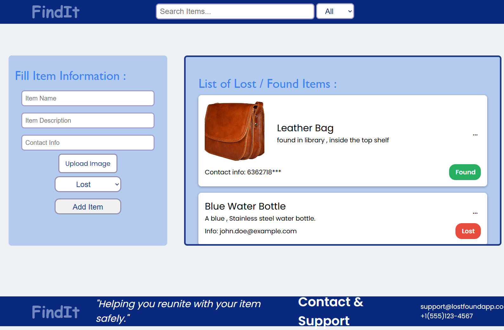

# 🧩 Lost & Found App (Vanilla JS)

This is a simple **Lost & Found management app** built using HTML, CSS, and JavaScript.  
It lets users add items that are lost or found, and view them in a clean card layout.

---

## ✨ Features
- ➕ Add lost/found items (name, description, contact, image).  
- 🔍 Search items by name.  
- 🏷 Filter items by status (Lost / Found).  
- 🗂 Basic UI with cards for each item.  

---

## 🛠 Tech Stack
- HTML  
- CSS  
- JavaScript (Vanilla JS)  

---

## 🚀 Live Demo  
👉 [View App](https://farheen-mulla.github.io/lost-and-found-app/)

---

## 🖼️ Preview
 Here's a screenshot of the app:
 

---
 
## 👨‍💻 Author
Made by Farheen Mulla(https://github.com/Farheen-Mulla)
